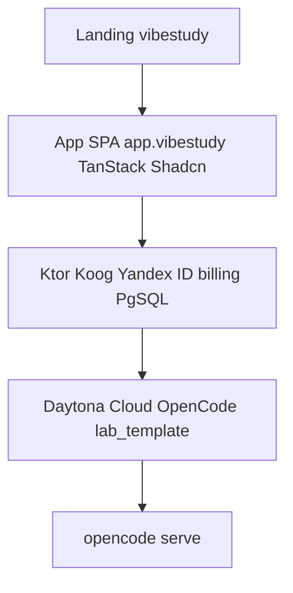
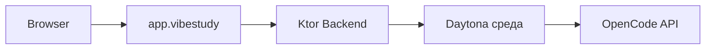
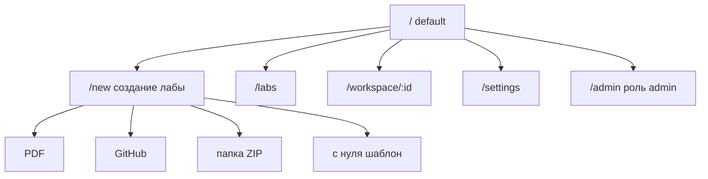
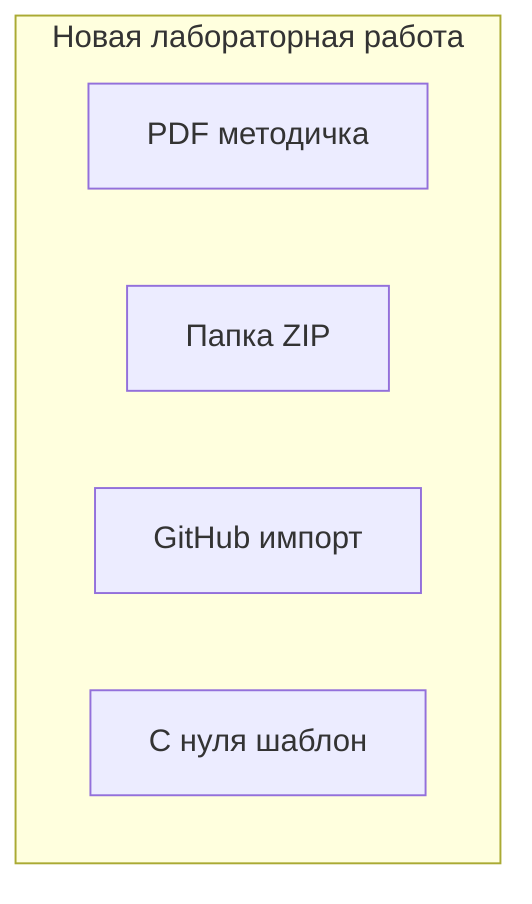
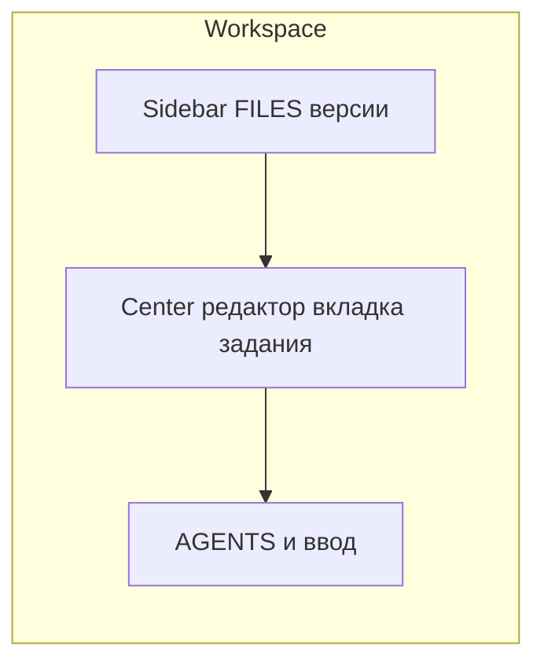
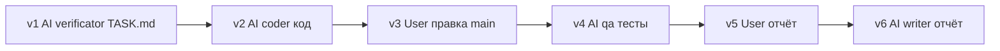
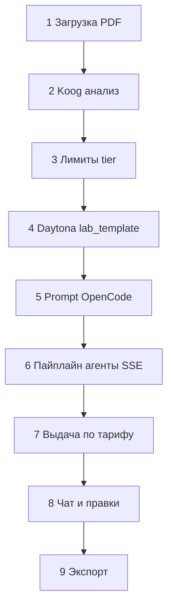
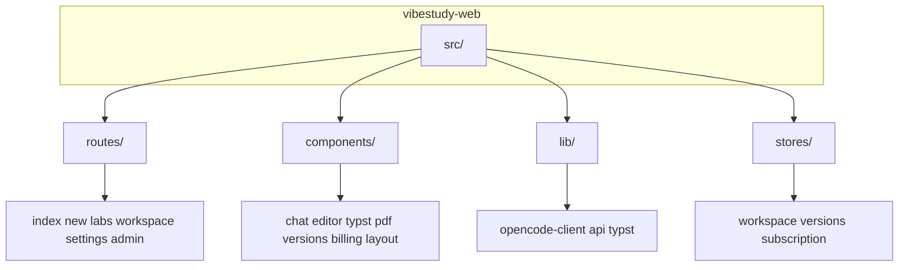
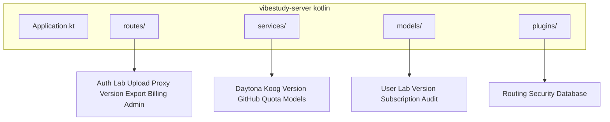

# VibeStudy — Архитектура проекта

Веб-платформа для автоматического выполнения лабораторных работ. Пользователь загружает PDF методички, система анализирует её, выполняет лабу через OpenCode (с мульти-агентной системой из `lab_template`) в облачной среде и получает результат. **Продукт ориентирован на полностью удалённое (Remote / Cloud) исполнение**; доступ к вычислениям и артефактам идёт через подписку и лимиты на бесплатном уровне.

## Общая архитектура

Локальный `opencode serve` на машине пользователя **не является целевым режимом продукта**; при необходимости он остаётся только инструментом разработки команды.

## Облачное исполнение (единственный пользовательский путь)

- Backend (Ktor) создаёт и управляет **изолированной средой в [Daytona Cloud](https://daytona.io/)** (вместо самостоятельной оркестрации Docker на своих серверах): внутри среды поднимается OpenCode с `lab_template`.
- Каждая лабораторная работа (или сессия) получает выделенную среду согласно политикам Daytona (жизненный цикл, лимиты ресурсов, очистка).
- Backend проксирует OpenCode API к фронтенду и применяет **тарифные ограничения** (см. ниже).

## Монетизация: бесплатный уровень и подписка

### Без подписки (free)

- **Модели**: только автоматически выбранные модели (пользователь не выбирает провайдера/модель).
- **Выходной артефакт**: в основном **методичка / отчётный документ** без полноценного доступа к **внутреннему коду** workspace (дерево файлов, исходники, детальный просмотр кода — отключены или сильно ограничены по продуктовой логике). На выдаваемых материалах — **водяной знак** (бренд / free tier).
- **Лимиты**: порядка **двух лабораторных работ в месяц** на пользователя (точное число конфигурируется на backend).

### С подпиской (paid)

- **Все функции продукта**: полный workspace (файлы, редактор, чат, версии, экспорт и т.д. без водяного знака на основных артефактах — по продуктовым правилам).
- **Выбор моделей** в интерфейсе и/или в настройках.
- **Качество**: для автоматических этапов пайплайна используются **более сильные модели по умолчанию** (политика routing на стороне backend / billing tier).

Биллинг, учёт лимитов и флагов tier хранятся в PostgreSQL; интеграция с платёжным провайдером подписки задаётся отдельно (не привязано к конкретному способу оплаты в этом документе).

## Авторизация: Яндекс ID

- Вход пользователей через **[Яндекс ID (OAuth)](https://yandex.ru/dev/id/doc/ru/)**: получение идентификатора Яндекса, согласование с записью `User` в БД, выдача сессии (JWT / cookie-сессия — на усмотрение реализации в `Security.kt`).
- Backend: маршруты обмена code → token, refresh при необходимости, привязка аккаунта к лабам и подписке.

## Административная панель

Отдельная **зона для операторов / владельцев продукта** (отдельный роут или поддомен, строгая авторизация по роли `admin` в БД):

- **Пользователи**: список, тариф, дата регистрации, блокировки.
- **Лабораторные**: статусы, привязка к средам Daytona, ошибки пайплайна, потребление квот.
- **Среды и очередь**: активные/завершённые среды Daytona, время жизни, перезапуск / принудительное завершение (если поддерживается API Daytona).
- **Мониторинг**: метрики API (latency, 5xx), здоровье OpenCode-прокси, агрегаты по LLM-вызовам (стоимость / токены — по мере внедрения), алерты.
- **Конфигурация**: лимиты free tier, включение водяного знака, списки разрешённых моделей для подписчиков.

Доступ к админке не через публичный self-service; только выданные администратором учётные записи с ролью.

## Целевая аудитория

Любые студенты любых вузов. Универсальный сервис.

## Технологический стек

| Компонент            | Технология                                    | Назначение                                     |
| -------------------- | --------------------------------------------- | ---------------------------------------------- |
| Landing              | Astro или отдельный TanStack SPA              | Маркетинговый сайт                             |
| App Frontend         | TanStack Router + Query, Shadcn UI, Tailwind  | SPA, routing, data fetching, UI                |
| Code Editor          | Monaco Editor                                 | Редактирование кода в file tree                |
| Typst Editor         | CodeMirror 6 + typst language support         | Редактирование отчетов                         |
| Typst Preview        | `@myriaddreamin/typst.ts` (WASM)              | Компиляция Typst в браузере, мгновенный превью |
| PDF Viewer           | `react-pdf` или `pdfjs-dist`                  | Просмотр загруженной методички                 |
| Backend              | Ktor (Kotlin)                                 | REST API, auth, прокси, оркестрация, лимиты    |
| AI Pre-processing    | Koog (Kotlin AI framework)                    | Анализ PDF перед отправкой в OpenCode          |
| DB                   | PostgreSQL + Exposed (Kotlin ORM)             | Пользователи, лабы, подписки, роли, версии     |
| Isolation (Cloud)    | [Daytona Cloud](https://daytona.io/)          | Удалённые среды с OpenCode вместо Docker       |
| OpenCode Integration | `@opencode-ai/sdk` (JS)                       | Связь frontend <-> OpenCode API                |
| Auth                 | [Яндекс ID](https://yandex.ru/dev/id/doc/ru/) | OAuth-авторизация пользователей                |
| Admin                | Отдельные маршруты SPA + Ktor admin API       | Мониторинг, пользователи, квоты, среды         |
| Export               | GitHub API (via Ktor)                         | Push результатов в репозиторий                 |

## Навигация приложения

По умолчанию приложение открывается на `/new` — создание новой лабы. Можно перейти к уже выполненным или в процессе.

## Импорт проекта

Пользователь может начать работу четырьмя способами:

- **PDF** — загрузка методички, создается workspace из `lab_template`
- **Папка/ZIP** — drag-and-drop или file picker, распаковывается в workspace
- **GitHub** — ввод URL репо, backend клонирует в workspace
- **С нуля** — пустой workspace из `lab_template` шаблона

Все варианты можно комбинировать (например, импорт GitHub репо + загрузка PDF методички).

## Workspace (рабочее пространство)

### Layout

Макет собран в **Paper Desktop** (MCP): артборд «VibeStudy Workspace» — HTML через `write_html`, палитра тёплых нейтралей, акцент терракотовой линии активной вкладки, три колонки: дерево и версии (иконки [HugeIcons](https://hugeicons.com/) stroke) · центр с вкладками файлов и отдельной вкладкой-превью задания `docs/report.typ` · панель агентов с Markdown и композером (вложения + send).

Идентичный по структуре **статичный HTML** для браузера и репозитория: [docs/design/workspace-layout-mockup.html](docs/design/workspace-layout-mockup.html).

Экспорт скриншота макета (1440×900):

VibeStudy — workspace layout

На **free tier** центральная зона (файлы / код) может быть скрыта или заменена упрощённым просмотром; чат и полный редактор — в полной мере у подписчиков.

### Компоненты workspace

- **File Tree** (левая панель) — дерево файлов через OpenCode `/file` API + блок **ВЕРСИИ** (иконки user / git на коммиты пользователя и AI)
- **Editor** (центр) — Monaco для кода, CodeMirror для Typst; вкладки файлов; вкладка **превью задания** (`docs/report.typ`) переключается иконкой и показывает рендер документа (в продукте — Typst/PDF, в мокапе — Markdown serif)
- **Agents** (правая панель) — сообщения в виде пузырей с **Markdown**, аватары-иконки ролей; поле ввода с **вложением файла**, кнопкой добавления контекста и **круглой** кнопкой отправки; стрим прогресса через SSE к OpenCode

## Система версий

Каждое значимое изменение сохраняется как версия (snapshot):

### Хранение версий

- **Cloud (основной путь)**: PostgreSQL + файловое хранилище (S3-совместимое или аналог), каждая версия = snapshot измененных файлов; состояние OpenCode внутри среды Daytona синхронизируется с этим хранилищем по правилам backend.

### Возможности

- Откат к любой предыдущей версии (AI или пользовательской)
- Просмотр diff между версиями
- Навигация по истории (кнопки ◀ ▶ в header)

## Флоу выполнения лабораторной

## Ключевые API OpenCode

| API                              | Для чего                                |
| -------------------------------- | --------------------------------------- |
| `POST /session`                  | Создание сессии для лабы                |
| `POST /session/:id/message`      | Отправка промпта (запуск report агента) |
| `POST /session/:id/prompt_async` | Асинхронная отправка (без ожидания)     |
| `GET /event` (SSE)               | Стриминг прогресса в реалтайм           |
| `GET /file?path=`                | File tree навигация                     |
| `GET /file/content?path=`        | Чтение файлов для редактора             |
| `GET /session/:id/diff`          | Diff изменений                          |
| `POST /session/:id/revert`       | Откат изменений AI                      |
| `POST /session/:id/unrevert`     | Восстановление откатанных               |
| `GET /agent`                     | Список доступных агентов                |
| `GET /global/health`             | Проверка подключения                    |
| `POST /session/:id/shell`        | Выполнение shell-команд                 |

## Структура Frontend

## Структура Backend (Ktor)

## Дизайн

- **Стиль**: Минималистичный, как Notion/Linear
- **Тема**: Переключаемая dark/light, обе поддерживаются
- **Язык интерфейса**: Русский в MVP
- **Landing**: Отдельный маркетинговый сайт с описанием, фичами, прайсингом (подписка vs free)
- **Приложение**: По умолчанию открывается на создании новой лабы

## Порядок реализации (MVP)

1. **Frontend shell** — роутинг, layout, тема (dark/light), Shadcn компоненты
2. **Яндекс ID** — вход, сессия, профиль в БД
3. **Страница создания лабы** — загрузка PDF, GitHub import, ZIP upload
4. **Backend (Ktor)** — API, Koog PDF pre-processing, квоты free tier
5. **Daytona + OpenCode** — создание среды на лабу, прокси API, завершение среды
6. **Workspace** — file tree, Monaco, Typst + WASM preview (с учётом tier в UI)
7. **Система версий** — snapshot/rollback в UI
8. **Подписка и биллинг** — активация paid tier, выбор моделей, снятие ограничений free
9. **Export** — ZIP download, GitHub push
10. **Админ-панель** — пользователи, лабы, среды, базовые метрики
11. **Landing page** — маркетинговый сайт

## Будущие фичи (после MVP)

- Мультиязычность (i18n)
- Шаблоны для конкретных вузов и предметов
- Совместная работа (collaboration)
- Интеграция с другими платформами (GitLab, Bitbucket)
- Мобильная версия
- Терминал в workspace
- Расширенный observability (трейсинг, SLO по лабам)

## Ссылки

- **Lab Template**: [https://github.com/pank-suai/lab_template](https://github.com/pank-suai/lab_template)
- **OpenCode Server API**: [https://opencode.ai/docs/server/](https://opencode.ai/docs/server/)
- **OpenCode SDK**: [https://opencode.ai/docs/sdk/](https://opencode.ai/docs/sdk/)
- **OpenCode Web**: [https://opencode.ai/docs/web/](https://opencode.ai/docs/web/)
- **Daytona**: [https://daytona.io/](https://daytona.io/)
- **Яндекс ID (документация)**: [https://yandex.ru/dev/id/doc/ru/](https://yandex.ru/dev/id/doc/ru/)

